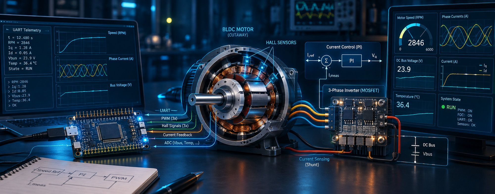
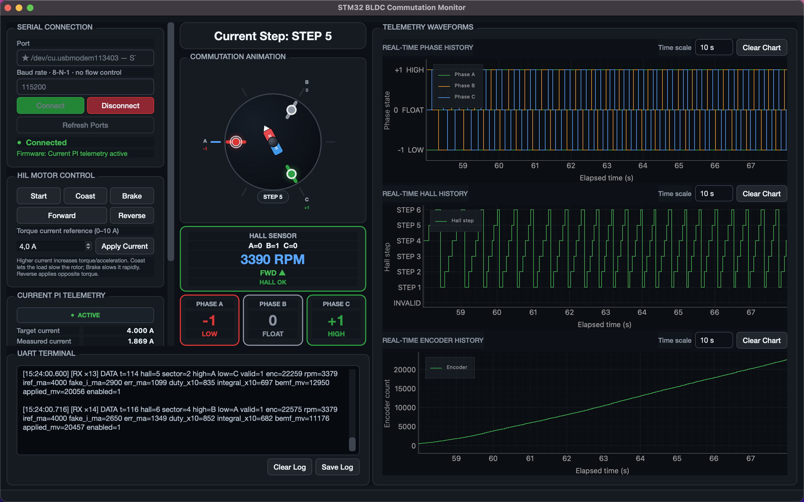
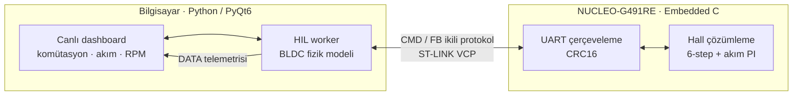

<p align="center">
  
</p>

<h1 align="center">STM32 & BLDC Motor Kontrolü — Staj Çalışmaları</h1>

<p align="center">
  STM32 tabanlı gömülü yazılım, BLDC motor komütasyonu, Hall/encoder geri bildirimi,<br>
  akım PI kontrolü, UART telemetrisi ve masaüstü HIL simülasyonu üzerine geliştirdiğim çalışmalar.
</p>

<p align="center">
  
  
  
  
  
</p>

## Genel bakış

Bu depo, staj süresince yaptığım gömülü sistem çalışmalarını ve bunları destekleyen teknik dokümanları bir araya getirir. Çalışmalar; temel LED/PWM uygulamalarından başlayıp altı adımlı BLDC komütasyonuna, gerçek Hall ve encoder verisinin işlenmesine, akım PI kontrolüne ve PC üzerinde çalışan fizik tabanlı Hardware-in-the-Loop (HIL) simülasyonuna kadar ilerler.

Öne çıkan kazanımlar:

- STM32CubeMX / STM32CubeIDE ile STM32F401, STM32F411 ve STM32G491 geliştirme
- GPIO, EXTI, timer, encoder modu, PWM, DMA, USB CDC ve UART çevre birimleri
- Hall sensörleriyle altı adımlı BLDC komütasyon tablosu ve yön tayini
- Anti-windup içeren akım PI kontrol döngüsü ve sanal elektrik motor modeli
- CRC16 korumalı ikili HIL haberleşmesi ve metin tabanlı telemetri
- PyQt6 ve pyqtgraph ile çok iş parçacıklı, gerçek zamanlı izleme arayüzü

## Canlı izleme arayüzü

<p align="center">
  
</p>

Arayüz; seri bağlantıyı, komütasyon adımını, faz durumlarını, Hall sensörlerini, encoder sayımını, RPM bilgisini ve akım PI telemetrisini aynı ekranda izler. HIL modunda masaüstündeki BLDC modeli ile STM32 üzerindeki kontrol algoritması kapalı çevrim çalışır.

## Sistem mimarisi



## Depo yapısı

| Dizin | İçerik |
|---|---|
| [`bldc_motor_simulation/`](bldc_motor_simulation/) | STM32G491 firmware taslağı, ikili HIL protokolü, BLDC fizik modeli ve birleşik PyQt6 uygulaması |
| [`Desktop app/`](Desktop%20app/) | UART üzerinden faz, Hall, encoder ve PI telemetrisi izleyen masaüstü uygulamasının önceki sürümü |
| [`projeler/led_intern_v2/`](projeler/led_intern_v2/) | STM32F401 üzerinde buton/EXTI ve yazılımsal LED PWM çalışması |
| [`projeler/staj_motor_simule/`](projeler/staj_motor_simule/) | STM32F411 ile üç faz durum üretimi ve USB CDC telemetrisi |
| [`projeler/staj_motor_simule_g491/`](projeler/staj_motor_simule_g491/) | NUCLEO-G491RE üzerinde Hall okuma, altı adımlı komütasyon ve UART telemetrisi |
| [`projeler/Real_motor_read_hall/`](projeler/Real_motor_read_hall/) | Gerçek Hall/encoder girdileri, sanal akım modeli, PI kontrolü ve testler |
| [`kaynaklar/`](kaynaklar/) | Staj notları, teknik rehberler, PDF dokümanlar ve çalışma ekran görüntüleri |

## Hızlı başlangıç

### Masaüstü uygulaması

Python 3.11 veya daha yeni bir sürümle:

```bash
cd bldc_motor_simulation/bldc_desktop/motor_control_app
python3 -m venv .venv
source .venv/bin/activate
python -m pip install --upgrade pip
python -m pip install -r requirements.txt
python main.py
```

Uygulamada NUCLEO kartının seri portunu seçin, firmware ile aynı baud hızını ayarlayın ve **Connect** düğmesine basın. Birleşik tek-port HIL senaryosu ve ayrıntılı kullanım için uygulama dizinindeki [README](bldc_motor_simulation/bldc_desktop/motor_control_app/README.md) ile [protokol dokümanına](bldc_motor_simulation/bldc_desktop/motor_control_app/protocol.md) bakabilirsiniz.

### STM32 firmware

1. İlgili proje dizinindeki `.ioc` dosyasını STM32CubeIDE ile açın.
2. CubeMX üzerinden kodu üretin ve projeyi derleyin.
3. Kartı ST-LINK ile programlayın.
4. Pin, UART ve HIL ayarları için [NUCLEO-G491 kurulum rehberini](bldc_motor_simulation/stm32/KURULUM_NUCLEO_G491.md) izleyin.

> Donanım bağlantılarını yapmadan önce kullanılan kartın pinlerini, lojik seviyelerini ve besleme sınırlarını doğrulayın. Motor sürme testlerinde uygun gate driver, akım sınırlama ve koruma devreleri kullanılmalıdır.

## Kart olmadan PI model testi

`Real_motor_read_hall` içindeki akım PI modeli standart bir C derleyicisiyle test edilebilir:

```bash
cd projeler/Real_motor_read_hall
cc -std=c11 -Wall -Wextra -Werror -ICore/Inc \
  Core/Src/current_pi_sim.c tests/test_current_pi_sim.c -lm \
  -o /tmp/current_pi_sim_test
/tmp/current_pi_sim_test
```

## Teknik notlar

- Kontrol ve telemetri hızları kullanılan firmware sürümüne göre değişebilir; bağlantıdan önce ilgili proje dokümanındaki baud değerini kontrol edin.
- `Debug/` klasörlerindeki çıktılar geliştirme sırasında üretilmiş örnek derleme artefaktlarıdır; kaynak kod için `Core/`, `Drivers/` ve `.ioc` dosyaları temel alınmalıdır.
- Bu depo bir staj çalışma arşividir. Bazı klasörler projenin farklı geliştirme aşamalarını bilerek korur.

---

<p align="center"><sub>Gömülü kontrol ile masaüstü simülasyonunu aynı geri besleme döngüsünde buluşturan bir staj projesi.</sub></p>
